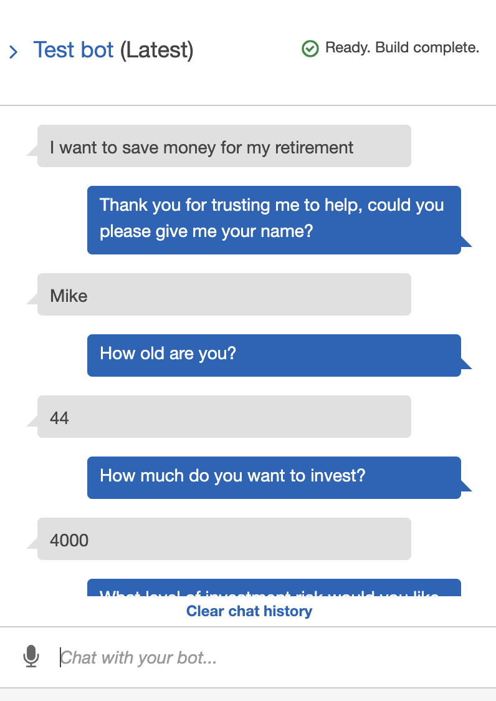
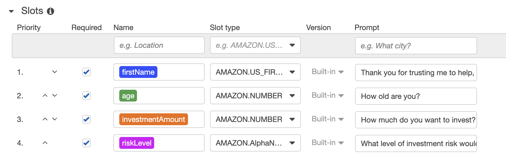

# AWS - Robo Advisor Bot

This repository outlines how we can create a bot that will recommend an investment portfolio for a retirement plan. To do this we will configure the initial robo advisor by defining an Amazon Lex bot. Then we will build and test the robo advisor bot, making sure the bot works and accurately responds during the conversation with the user. Finally we will enhance the robo advisor with an Amazon Lambda function to validate the user's input and return the investment portfolio recommendation. 

---

## Technologies

This project uses AWS and the python language to test and operate the bot:

- AWS Lex: to create the bot and create sample utterances, slots, confirmation, and intitialization.
- AWS Lambda: to validates the user's input and returns the investment portfolio recommendation. This includes testing the Amazon Lambda function and integrating it with the bot.



---

## Usage

To succesfully run this bot, please be sure to import the required libraries and dependencies in the python file:

```
from datetime import datetime
from dateutil.relativedelta import relativedelta
```



---


## Conclusion

I created the Bot and intially tested it. I then began to create the lambda function code. I got as far as _Step 3: Enhance the Robo Advisor with an Amazon Lambda Function, #4 Complete the starter code so that once the intent is fulfilled, the bot responds with an investment recommendation based on the selected risk level, as follows_ before not continuing. I added the 4 test events in AWS. I did not test however due to issues with the code. 

Screen recording is found on the main branch as roboadvisor_test_screenrecording.mov

---

## Contributors

Michael Husary was the main contributer along with fellow classmates and the educational staff. 

--- 

## License

N/A
*(Not sure if a license was required on this Challenge)*
